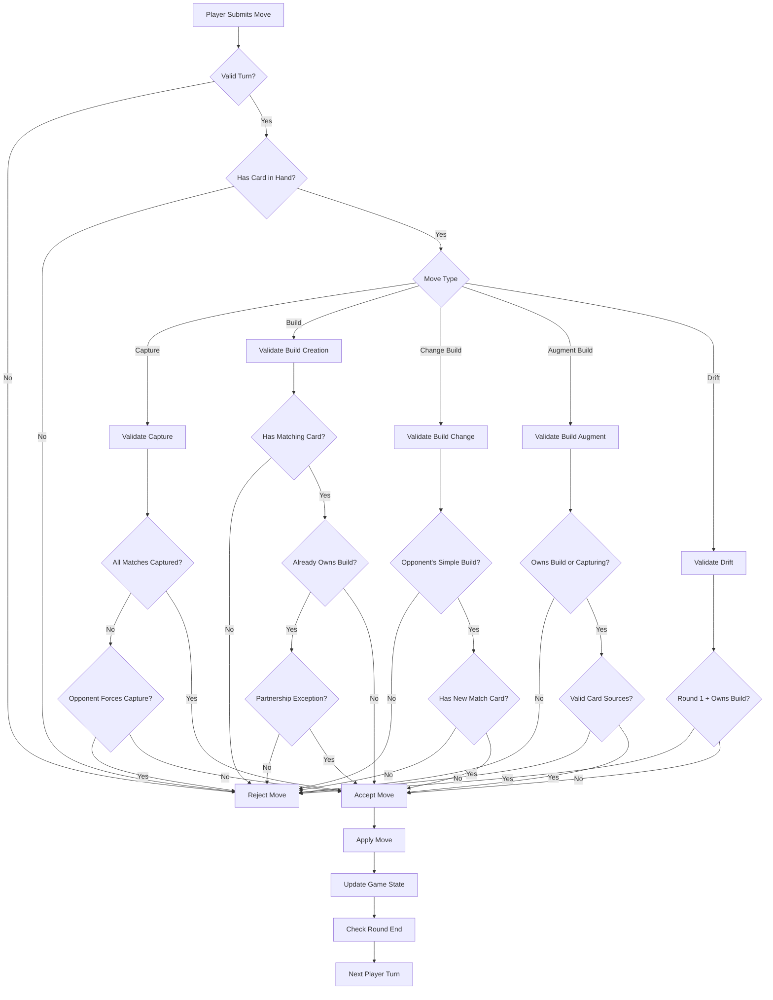
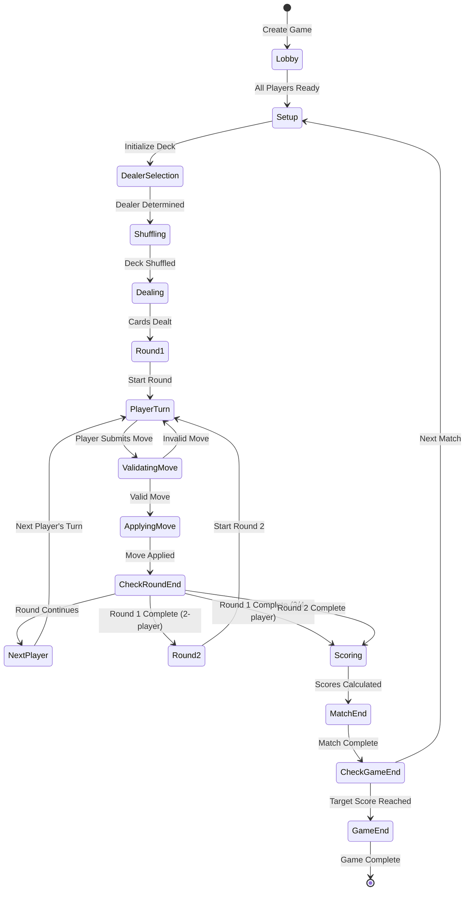

# SECTION 3: GAME DESIGN DOCUMENT (GDD)

## Khasino - Complete Game Rules & Mechanics

**Version:** 2.0
**Date:** June 2026
**Status:** Authoritative Game Rules Reference

---

## Table of Contents

1. [Game Overview](#game-overview)
2. [Core Gameplay](#core-gameplay)
3. [Game Setup](#game-setup)
4. [Turn Structure](#turn-structure)
5. [Card Mechanics](#card-mechanics)
6. [Build Mechanics](#build-mechanics)
7. [Capture Mechanics](#capture-mechanics)
8. [Partnership Mechanics](#partnership-mechanics)
9. [Scoring System](#scoring-system)
10. [Win Conditions](#win-conditions)
11. [Edge Cases & Special Rules](#edge-cases--special-rules)
12. [Rule Validation Logic](#rule-validation-logic)
13. [Game State Machine](#game-state-machine)

---

## 1. Game Overview

### 1.1 Game Identity

**Name:** Khasino (also known as South African Casino)
**Type:** Strategic Card Game
**Players:** 2-4 players
**Deck:** 40 cards (Ace through 10, four suits)
**Duration:** 10-25 minutes per match
**Complexity:** Medium to High

### 1.2 Objective

The primary objective is to **capture as many points as possible** through strategic card play, building, and capturing. Points are earned through:
- Capturing specific high-value cards
- Capturing the most total cards
- Capturing the most spades

### 1.3 Key Concepts

**Chowing (Capturing):** Taking cards from the table using a matching card from hand

**Building:** Creating a pile of cards on the table that sum to a specific value

**Drifting:** Playing a card without capturing anything

**Stashing:** Placing a matching card on your own build to strengthen it

**Compound Build:** A build with multiple sets of cards that sum to the same value

---

## 2. Core Gameplay

### 2.1 Game Flow

```
Setup Phase
    ↓
Determine Dealer (Draw highest card)
    ↓
Shuffle & Cut Deck
    ↓
Deal Cards (based on player count)
    ↓
┌─────────────────────────────┐
│     ROUND 1 (First Deal)    │
│  Players take turns until   │
│   all hand cards played     │
└─────────────────────────────┘
    ↓
Deal Round 2 (2-player only)
    ↓
┌─────────────────────────────┐
│     ROUND 2 (Second Deal)   │
│  Players take turns until   │
│   all hand cards played     │
└─────────────────────────────┘
    ↓
Last Capture Bonus (remaining table cards)
    ↓
Calculate Scores
    ↓
Determine Winner
```

### 2.2 Gameplay Principles

1. **Turn-Based:** Players alternate turns in counter-clockwise order
2. **Server-Authoritative:** All moves validated by game engine
3. **Perfect Information:** All table cards and builds are visible
4. **Hidden Information:** Opponent hand cards are hidden
5. **No Randomness:** After deal, gameplay is purely skill-based

---

## 3. Game Setup

### 3.1 Deck Composition

**Total Cards:** 40
**Ranks:** Ace (value 1), 2, 3, 4, 5, 6, 7, 8, 9, 10
**Suits:** Spades (♠), Hearts (♥), Diamonds (♦), Clubs (♣)

**Card Values:**
- Ace = 1 point (also worth 1 point in scoring)
- 2-9 = Face value
- 10 = 10 points
- Two of Spades = 1 point (special "Spy Two")
- Ten of Diamonds = 2 points (special "Mummy")

### 3.2 Dealer Selection

```
FOR each player:
    Draw one card from shuffled deck

dealer = player with highest card value
IF tie:
    Tied players draw again until winner determined

RETURN dealer
```

### 3.3 Dealing Rules

#### 3.3.1 Two Players
- **Round 1:** 10 cards to each player, no table cards
- **Round 2:** Remaining 10 cards to each player
- **Total:** 20 cards per player across 2 rounds

#### 3.3.2 Three Players
- **Round 1:** 13 cards to each player, 1 card face-up on table
- **Total:** 13 cards per player, single deal

#### 3.3.3 Four Players
- **Round 1:** 10 cards to each player, no table cards
- **Total:** 10 cards per player, single deal

### 3.4 Initial Table State

**2 Players:** Empty table (first player must drift)
**3 Players:** One face-up card on table
**4 Players:** Empty table (first player must drift)

---

## 4. Turn Structure

### 4.1 Turn Phases

Every turn consists of these possible actions (in any order):

```
START TURN
    ↓
┌──────────────────────────────────┐
│ Optional: Augment Existing Build │ (before playing card from hand)
│ - Can be repeated multiple times │
└──────────────────────────────────┘
    ↓
┌──────────────────────────────────┐
│ Mandatory: Play One Card         │
│ Choose ONE of:                   │
│ 1. Capture (Chow)                │
│ 2. Create Build                  │
│ 3. Change Build Value            │
│ 4. Augment Build (with hand card)│
│ 5. Discard (Drift)               │
└──────────────────────────────────┘
    ↓
Validate Move
    ↓
Update Game State
    ↓
END TURN (next player)
```

### 4.2 Turn Order

- **Direction:** Counter-clockwise
- **Starting Player:** Player to dealer's right (in real-world; in digital: next player after dealer)
- **Turn Rotation:** Continuous until all hands exhausted

### 4.3 Turn Actions Detailed

#### Action 1: Capture (Chow)

Play a card from hand to take cards from table.

**Conditions:**
- Card value matches single table card → capture that card
- Card value matches sum of multiple table cards → capture that set
- Card value matches build value → capture entire build
- Can capture multiple matches simultaneously

**Example:**
```
Hand: [10]
Table: [6, 4, 3, 2, Build-10(7+3)]
Play 10 → Captures: 10, (6+4), Build-10, (3+2+3+2 if another 2 exists)
```

#### Action 2: Create Build

Combine table cards (optionally with hand card) to create a build.

**Requirements:**
- Must have matching card in hand to later capture
- Can only own one build at a time (exception: partnership stash)
- Small card must be on top of build

**Example:**
```
Hand: [10, 5, 3]
Table: [6, 4, 2]
Create Build-10 using 6+4 → Stack as [6, 4] with 4 on top
```

#### Action 3: Change Build Value

Take opponent's single build and change its value.

**Requirements:**
- Build must be owned by opponent (not yourself/partner)
- Build must be single build (not compound)
- Add one card from hand
- Must have new matching card in hand

**Example:**
```
Opponent Build-9: [5, 4]
Hand: [10, Ace]
Play Ace on build → New Build-10: [5, 4, 1]
Take ownership of build
```

#### Action 4: Augment Build

Add cards to existing build to make it compound.

**Can use:**
- Single cards from table
- One card from hand
- Top card of opponent's capture pile

**Cannot use:**
- Cards from own/partner capture pile
- Cards from builds

**Example:**
```
Own Build-9: [5, 4]
Table: [6, 3]
Augment → Compound Build-9: [(5,4), (6,3)]
```

#### Action 5: Discard (Drift)

Play a card to table without capturing.

**Restrictions:**
- CANNOT drift in 2-player Round 1 if you own a build
- CAN drift in all other situations
- Cannot abandon build by using all capture cards

---

## 5. Card Mechanics

### 5.1 Card Values & Matching

**Ace:** Value = 1
**2-10:** Face value

**Matching Rules:**
- Exact match: 7 matches 7
- Sum match: 7 matches (4+3), (5+2), (4+2+1), etc.
- Build match: 7 matches Build-7

### 5.2 Special Cards

#### 5.2.1 Two of Spades ("Spy Two")
- **Value:** 2 (for gameplay)
- **Points:** 1 (for scoring)
- **Strategic Importance:** High (point card)

#### 5.2.2 Ten of Diamonds ("Mummy")
- **Value:** 10 (for gameplay)
- **Points:** 2 (for scoring)
- **Strategic Importance:** Highest single card points

#### 5.2.3 Aces (All Four Suits)
- **Value:** 1 (for gameplay)
- **Points:** 1 each (for scoring)
- **Total Ace Points:** 4
- **Strategic Importance:** High (multiple points, flexible in builds)

### 5.3 Suit Significance

**Spades:** Most spades = 2 points (1 each if tied)
**Diamonds:** Ten of Diamonds = 2 points
**Hearts/Clubs:** No special scoring value

---

## 6. Build Mechanics

### 6.1 Build Types

#### 6.1.1 Simple Build

A single pile of cards that sum to a target value.

**Structure:**
```
Build-10: [6, 3, 1]  // 6+3+1=10
         Top→ 1
              3
         Bot→ 6
```

**Rules:**
- Small card on top
- Sum equals declared value
- Can be changed by opponents
- Owner must have matching card

#### 6.1.2 Compound Build

Multiple sets of cards, each summing to the same value.

**Structure:**
```
Compound Build-9: [(5,4), (6,3), (9)]
                  Set1   Set2  Set3
```

**Rules:**
- Each set independently sums to declared value
- CANNOT be changed once compound
- Can only be augmented or captured
- More secure than simple builds

### 6.2 Building Rules

#### 6.2.1 Creating a Build

```python
def can_create_build(hand_cards, table_cards, build_value):
    # Must have matching card in hand
    if build_value not in hand_cards:
        return False

    # Must not already own a build (except partnership exception)
    if player.owns_build and not (is_partnership and partner.owns_build):
        return False

    # Selected cards must sum to build_value
    if sum(selected_cards) != build_value:
        return False

    # Maximum build value is 10
    if build_value > 10:
        return False

    return True
```

#### 6.2.2 Build Ownership

- Build is owned by creator
- Ownership transfers if build value changed
- Owner is responsible for capturing
- Cannot abandon owned build

#### 6.2.3 Build Value Constraints

**Minimum:** 1 (single Ace)
**Maximum:** 10
**Reason:** Maximum card value is 10

### 6.3 Stashing

**Definition:** Placing a matching card on your own build without capturing it.

**Purpose:**
- Solidify build (make it compound)
- Prevent opponent from changing value
- Strategic delay of capture

**Rules:**
```
Own Build-7: [4, 3]
Hand: [7, 7]

Turn 1: Play 7 on build, declare "Stash"
        → Compound Build-7: [(4,3), (7)]

Turn 2: (Later) Play 7 to capture
        → Capture entire compound build
```

**Stash Conditions:**
- Can only stash on own build
- Must have at least 2 matching cards originally
- Announces "Stash" to indicate intention
- Build remains in play

### 6.4 Augmenting Builds

#### 6.4.1 Augmenting Own Build

**Sources:**
- ✅ Table cards (loose cards)
- ✅ One card from hand
- ✅ Top card of opponent's capture pile
- ❌ Own/partner capture pile cards

**Process:**
```
Own Build-8: [5, 3]
Table: [6, 2]
Opponent Pile Top: [4]

Can augment:
- Take 6+2 from table → [(5,3), (6,2)]
- Take 4 from opponent + 4 from table → [(5,3), (4,4)]
```

#### 6.4.2 Augmenting Opponent Build

**Condition:** Must capture in same turn

**Process:**
```
Opponent Build-9: [5, 4]
Table: [6, 3]
Hand: [9]

Play 9:
1. Augment opponent build: (6+3) from table
2. Capture entire compound build: [(5,4), (6,3)]
```

### 6.5 Changing Build Value

**Only for Simple Builds:**

```python
def can_change_build_value(build, hand_card, new_value):
    # Must be opponent's build
    if build.owner == current_player:
        return False

    # Must be simple build (not compound)
    if build.is_compound:
        return False

    # New value = old value + hand card
    if new_value != build.value + hand_card.value:
        return False

    # Must have matching card for new value
    if new_value not in player.hand:
        return False

    return True
```

**Example:**
```
Opponent Simple Build-7: [4, 3]
Hand: [9, 2]

Play 2 on build:
- New value: 7 + 2 = 9
- New Build-9: [4, 3, 2]
- Ownership transfers to you
```

---

## 7. Capture Mechanics

### 7.1 Capture Rules

#### 7.1.1 Basic Capture

```python
def get_capturable_cards(played_card, table_state):
    captures = []
    value = played_card.value

    # Single card matches
    for card in table_state.loose_cards:
        if card.value == value:
            captures.append([card])

    # Combination matches
    for combo in get_combinations(table_state.loose_cards):
        if sum(combo) == value:
            captures.append(combo)

    # Build matches
    for build in table_state.builds:
        if build.value == value:
            captures.append(build)

    return captures
```

#### 7.1.2 Multiple Captures

Players can capture multiple separate matches in one turn.

**Example:**
```
Play: 10
Table: [10, (6+4), Build-10(7+3)]

Capture ALL:
- Single 10
- 6+4 combination
- Build-10

Total: 6 cards captured
```

#### 7.1.3 Mandatory Capture

**Rule:** If you play a card that CAN capture, opponents may force you to capture all eligible cards.

**Exception:** If card is used to build (not capture/discard), no obligation.

**Purpose:** Prevent strategic incomplete captures.

### 7.2 Capture Pile

**Properties:**
- Each player has own capture pile
- Face-down except top card
- Top card visible to all players
- Cards counted at end for scoring

**Top Card Usage:**
- Opponent's top card can be used to augment builds
- Cannot use own/partner top card for builds
- Must have "base" before using top card

### 7.3 Last Capture Bonus

**Rule:** Player who makes final capture of the match takes all remaining table cards.

**Impact:**
- Can swing "most cards" points
- Strategic consideration for last turns
- Important in close games

---

## 8. Partnership Mechanics

### 8.1 Partnership Setup

**4-Player Mode:**
- Opposite players are partners
- Positions: N-S vs E-W
- Share capture pile and builds
- Coordinate strategy

**Scoring:**
- Partners combine captured cards
- Team scoring for all point categories
- Win/loss as a team

### 8.2 Partnership Rules

#### 8.2.1 Building for Partner

**Standard Rule:** Cannot build for partner

**Exception:** Partner Build Recovery
```
IF:
    Partner created Build-X
    AND opponent changed it OR captured it
    AND partner has not played a card of value X since
THEN:
    You can create new Build-X
    Build is owned by partner
```

**Reasoning:** Proves partner still holds matching card.

#### 8.2.2 Stashing with Partner (Shiya)

**Scenario:**
```
Partner: Has Build-8, plays 8 to capture
You: Have 8 in hand, declare "Shiya!" (Stash!)

Result:
Partner: Places 8 on build instead of capturing
You: Take ownership of build
You: Now own TWO builds (original + new)
```

**Exception to One-Build Rule:**
- Only scenario where player owns 2 builds
- Must capture one on next turn
- Can capture either build

#### 8.2.3 Partnership Communication

**Allowed:**
- "Shiya" / "Stash" declarations
- Legal game announcements

**Prohibited:**
- Revealing hand cards
- Discussing strategy mid-game
- Signaling specific plays

### 8.3 Partnership Strategy

**Coordination:**
- Setting up builds for partner
- Protecting partner's builds
- Maximizing team captures

**Build Handoffs:**
- Partner A creates build
- Partner B augments/captures
- Efficient point collection

---

## 9. Scoring System

### 9.1 Point Categories

#### 9.1.1 Two-Player & Partnership (11 Points Total)

| Category | Points | Tie Handling |
|----------|--------|--------------|
| Most Cards | 2 | 1-1 split if tied |
| Most Spades | 2 | 1-1 split if tied |
| Two of Spades ("Spy Two") | 1 | Winner takes all |
| Ten of Diamonds ("Mummy") | 2 | Winner takes all |
| Ace of Spades | 1 | Winner takes all |
| Ace of Hearts | 1 | Winner takes all |
| Ace of Diamonds | 1 | Winner takes all |
| Ace of Clubs | 1 | Winner takes all |
| **Total** | **11** | |

#### 9.1.2 Three-Player & Four-Player Singles (7 Points Total)

| Category | Points | Note |
|----------|--------|------|
| ~~Most Cards~~ | ~~0~~ | Not counted |
| ~~Most Spades~~ | ~~0~~ | Not counted |
| Two of Spades | 1 | Counted |
| Ten of Diamonds | 2 | Counted |
| Ace of Spades | 1 | Counted |
| Ace of Hearts | 1 | Counted |
| Ace of Diamonds | 1 | Counted |
| Ace of Clubs | 1 | Counted |
| **Total** | **7** | |

### 9.2 Scoring Algorithm

```python
def calculate_score(player, mode, all_players):
    score = 0
    cards = player.captured_cards

    # Special cards (always counted)
    if TWO_OF_SPADES in cards:
        score += 1

    if TEN_OF_DIAMONDS in cards:
        score += 2

    for ace in [ACE_SPADES, ACE_HEARTS, ACE_DIAMONDS, ACE_CLUBS]:
        if ace in cards:
            score += 1

    # Most cards (only in 2-player or partnership mode)
    if mode in ['two_player', 'partnership']:
        card_counts = [len(p.captured_cards) for p in all_players]
        max_cards = max(card_counts)
        tied_players = [p for p in all_players if len(p.captured_cards) == max_cards]

        if len(tied_players) == 1 and player in tied_players:
            score += 2
        elif len(tied_players) > 1 and player in tied_players:
            score += 1  # Tied for most

    # Most spades (only in 2-player or partnership mode)
    if mode in ['two_player', 'partnership']:
        spade_counts = [count_spades(p.captured_cards) for p in all_players]
        max_spades = max(spade_counts)
        tied_players = [p for p in all_players if count_spades(p.captured_cards) == max_spades]

        if len(tied_players) == 1 and player in tied_players:
            score += 2
        elif len(tied_players) > 1 and player in tied_players:
            score += 1  # Tied for most

    return score

def count_spades(cards):
    return len([c for c in cards if c.suit == 'SPADES'])
```

### 9.3 Match Scoring

**Single Match:** First to reach target score (e.g., 21 points)
**Best of X:** Best of 3, 5, or 7 matches
**Tournament:** Accumulate points across multiple matches

---

## 10. Win Conditions

### 10.1 Match Victory

**Condition:** Player/team with highest score after all cards played

**Tiebreaker:**
1. Most cards captured
2. Most spades captured
3. Sudden death round (deal new cards)

### 10.2 Game Victory

**Target Score:** Configurable (default 21 points)

**Win Condition:**
```
IF player.total_score >= target_score:
    IF player.total_score > all_other_scores:
        WINNER = player
    ELSE:
        Continue to next match (target score increases)
```

### 10.3 Tournament Victory

**Format:** Single/double elimination or round-robin
**Advancement:** Win required number of matches
**Finals:** Best of X matches

---

## 11. Edge Cases & Special Rules

### 11.1 Two-Player Special Rules

#### 11.1.1 Round 1 Drift Restriction

**Rule:** In Round 1, cannot drift if you own a build.

**Reasoning:** Prevents building then abandoning to deny opponent.

**Exception:** Round 2 allows drifting even with owned builds.

```python
def can_drift(player, round_number):
    if round_number == 2:
        return True  # Always can drift in round 2

    if player.owns_build:
        return False  # Cannot drift in round 1 with build

    return True
```

### 11.2 Opponent Capture Pile Usage

#### 11.2.1 Top Card Rule

**Rule:** Only the top card of opponent's pile can be used.

**Sequential Access:**
```
Opponent Pile: [10, 7, 5, 3, ...]  (top to bottom)

Turn 1: Use 10 in augmentation → 7 now visible
Turn 2: Use 7 in augmentation → 5 now visible
```

#### 11.2.2 Cannot Return to Same Pile Twice

**Complex Rule:**
```
Opponent A Pile Top: 3
Opponent B Pile Top: 7

Building 10:
1. Take 7 from Opponent B (big card first)
2. Take 3 from Opponent A (small card)
3. Opponent A next card: 6
4. Opponent B next card: 4

CANNOT return to Opponent B to take the 4
MUST start elsewhere first
```

**Reasoning:** Small card on top principle - must take bigger values first.

### 11.3 Build Constraints

#### 11.3.1 No Duplicate Build Values

**Rule:** Cannot have two builds of same value on table simultaneously.

**Example:**
```
Opponent has Build-9

You CANNOT create separate Build-9

You CAN:
- Augment opponent's Build-9 (if capturing same turn)
- Create Build-9 by augmenting your existing build
```

#### 11.3.2 Build Abandonment Prevention

**Rule:** Cannot use all your capture cards for other purposes if you own a build.

**Example:**
```
Own Build-8
Hand: [8, 8]

ILLEGAL: Play both 8s to capture other cards, leaving build unowned
LEGAL: Use one 8 to capture build, other 8 elsewhere
```

### 11.4 Base Requirements

**Definition:** A "base" is needed before using opponent's pile top card.

**Valid Bases:**
- Build owned by you/partner
- Single table card you can match from hand
- Single table card partner can match (if partner made Build-X that was taken)

**Example:**
```
Opponent Pile Top: 6
No builds, no table cards

CANNOT use the 6 (no base to augment)

If table had a 4:
CAN build: 4 + opponent's 6 = 10 (if have 10 in hand)
```

---

## 12. Rule Validation Logic

### 12.1 Move Validation Flow



### 12.2 Validation Functions

```python
class MoveValidator:

    def validate_capture(self, player, card, targets):
        """Validate a capture move."""
        if card not in player.hand:
            return False, "Card not in hand"

        # Check each target is valid
        for target in targets:
            if not self.can_capture(card, target):
                return False, f"Cannot capture {target} with {card}"

        # Check all possible captures included
        all_possible = self.get_all_capturable(card, game_state)
        if not self.includes_all_required(targets, all_possible):
            return False, "Must capture all possible matches"

        return True, "Valid capture"

    def validate_build_creation(self, player, cards, value, hand_card=None):
        """Validate creating a new build."""
        # Must have matching card in hand
        if value not in player.hand:
            return False, "Must have matching card in hand"

        # Cannot own another build (except partnership exception)
        if player.owned_build and not self.is_partnership_exception():
            return False, "Already own a build"

        # Cards must sum to value
        total = sum([c.value for c in cards])
        if hand_card:
            total += hand_card.value

        if total != value:
            return False, f"Cards sum to {total}, not {value}"

        # Value must be 1-10
        if value < 1 or value > 10:
            return False, "Build value must be 1-10"

        return True, "Valid build creation"

    def validate_build_change(self, player, build, hand_card, new_value):
        """Validate changing an opponent's build value."""
        # Must be opponent's build
        if build.owner == player or build.owner == player.partner:
            return False, "Cannot change own/partner build"

        # Must be simple build
        if build.is_compound:
            return False, "Cannot change compound build"

        # New value must equal old + hand card
        if new_value != build.value + hand_card.value:
            return False, "Invalid new value"

        # Must have matching card for new value
        if new_value not in player.hand:
            return False, "Must have matching card for new value"

        return True, "Valid build change"

    def validate_build_augment(self, player, build, cards, hand_card=None):
        """Validate augmenting a build."""
        # If opponent's build, must capture this turn
        if build.owner != player and build.owner != player.partner:
            if not self.is_capturing_this_turn():
                return False, "Must capture opponent build when augmenting"

        # Check card sources are valid
        for card in cards:
            if not self.is_valid_augment_source(card, player):
                return False, f"Invalid augment source: {card}"

        # Cards must sum to build value
        total = sum([c.value for c in cards])
        if hand_card:
            total += hand_card.value

        if total != build.value:
            return False, "Augment cards must sum to build value"

        return True, "Valid augmentation"

    def validate_drift(self, player, card, round_num):
        """Validate playing a card without capturing."""
        if card not in player.hand:
            return False, "Card not in hand"

        # Special rule: Round 1 of 2-player cannot drift with owned build
        if game.player_count == 2 and round_num == 1:
            if player.owned_build:
                return False, "Cannot drift in Round 1 with owned build"

        # Cannot drift if would abandon build
        remaining_capture_cards = [c for c in player.hand if c.value == player.owned_build.value]
        if len(remaining_capture_cards) == 1 and card in remaining_capture_cards:
            return False, "Cannot abandon build"

        return True, "Valid drift"
```

---

## 13. Game State Machine

### 13.1 State Diagram



### 13.2 State Definitions

**LOBBY**
- Players joining
- Waiting for ready signals
- Configuration settings

**SETUP**
- Initialize 40-card deck
- Set player positions
- Determine game mode

**DEALER_SELECTION**
- Each player draws card
- Highest card becomes dealer
- Handle ties

**SHUFFLING**
- Dealer shuffles deck
- Opponent cuts deck
- Deck randomized

**DEALING**
- Distribute cards based on player count
- Place table cards (if 3-player)
- Set initial game state

**ROUND_1 / ROUND_2**
- Players take turns
- Game mechanics active
- Builds and captures tracked

**PLAYER_TURN**
- Current player's turn
- Timer active (optional)
- Awaiting player action

**VALIDATING_MOVE**
- Server validates move
- Check all rules
- Prevent cheating

**APPLYING_MOVE**
- Update game state
- Move cards
- Update builds/captures

**CHECK_ROUND_END**
- All hands empty?
- Trigger last capture bonus
- Determine if more rounds

**SCORING**
- Count captured cards
- Calculate points
- Determine match winner

**MATCH_END**
- Display match results
- Update player stats
- Check if game continues

**CHECK_GAME_END**
- Has player reached target score?
- Determine overall winner
- End game or continue

**GAME_END**
- Final results
- Award prizes/XP
- Update leaderboards

---

## 14. Glossary

**Ace:** Card with value 1, worth 1 point in scoring

**Augment:** Adding cards to a build to make it compound

**Base:** A build or card needed before using opponent's pile

**Build:** A pile of cards on table summing to a declared value

**Capture / Chow:** Taking cards from table using a matching hand card

**Compound Build:** A build with multiple sets summing to same value

**Dealer:** Player who shuffles and deals cards

**Drift:** Playing a card without capturing anything

**Last Capture:** Taking remaining table cards at game end

**Mummy:** Ten of Diamonds, worth 2 points

**Partnership:** Team mode with 4 players (2v2)

**Round:** One dealing of cards (2-player has 2 rounds)

**Shiya / Stash:** Partner taking over your build

**Simple Build:** A single set of cards summing to a value

**Spy Two:** Two of Spades, worth 1 point

**Stash:** Placing matching card on own build without capturing

**Table:** Central play area with loose cards and builds

**Turn:** One player's complete action sequence

---

*This Game Design Document is authoritative for all game implementation. Any ambiguities should be resolved in favor of player experience and cultural authenticity.*

**Last Updated:** June 2, 2026
**Version:** 2.0
