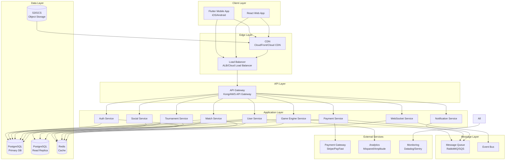
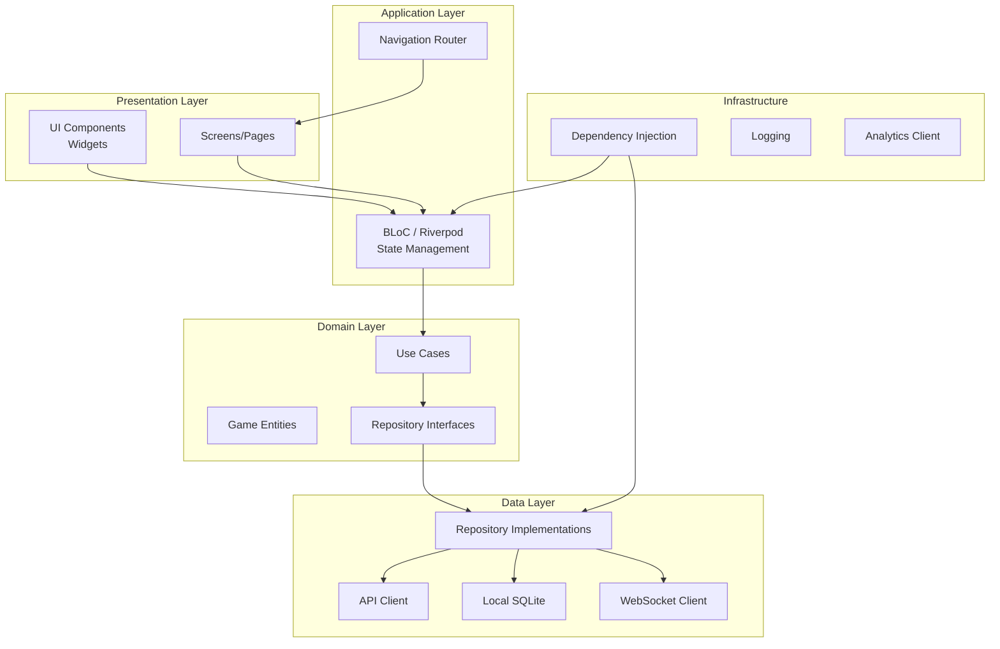
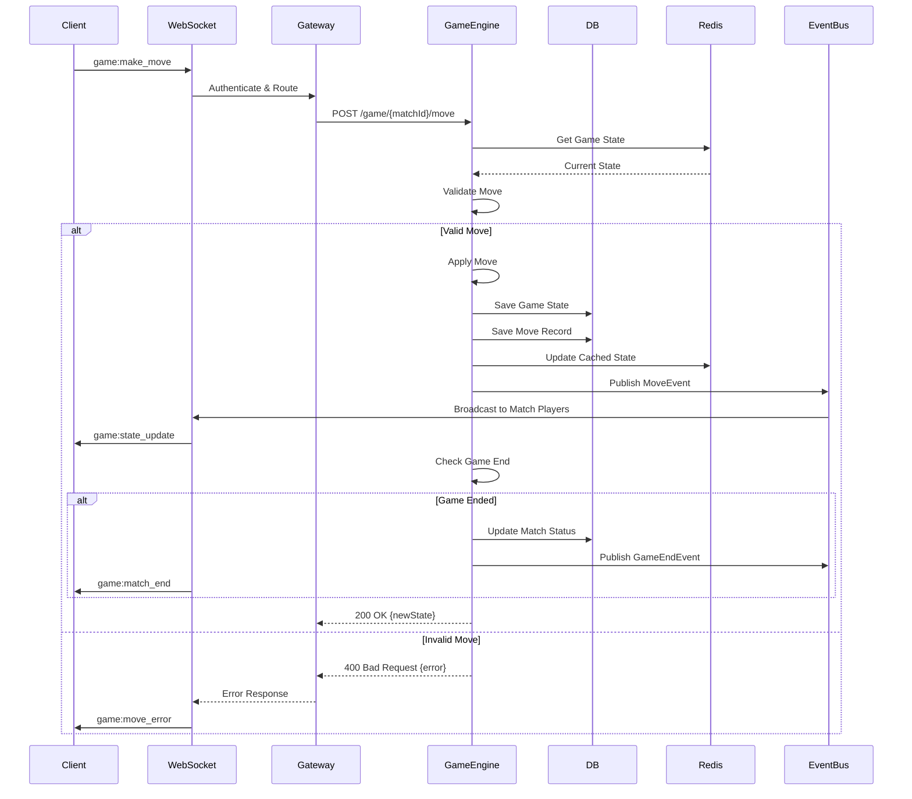
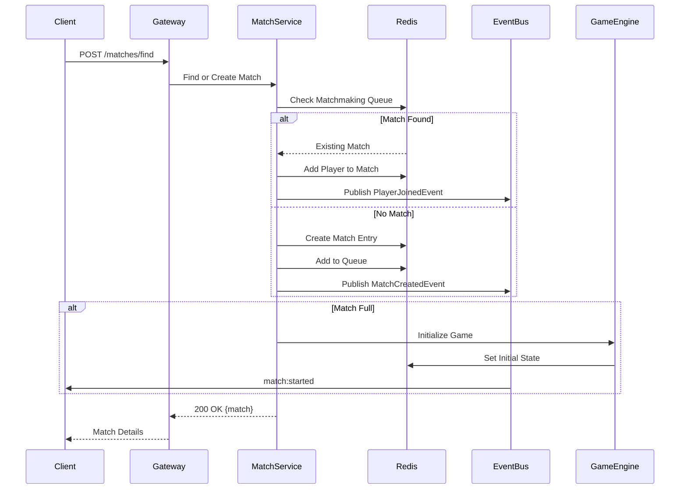
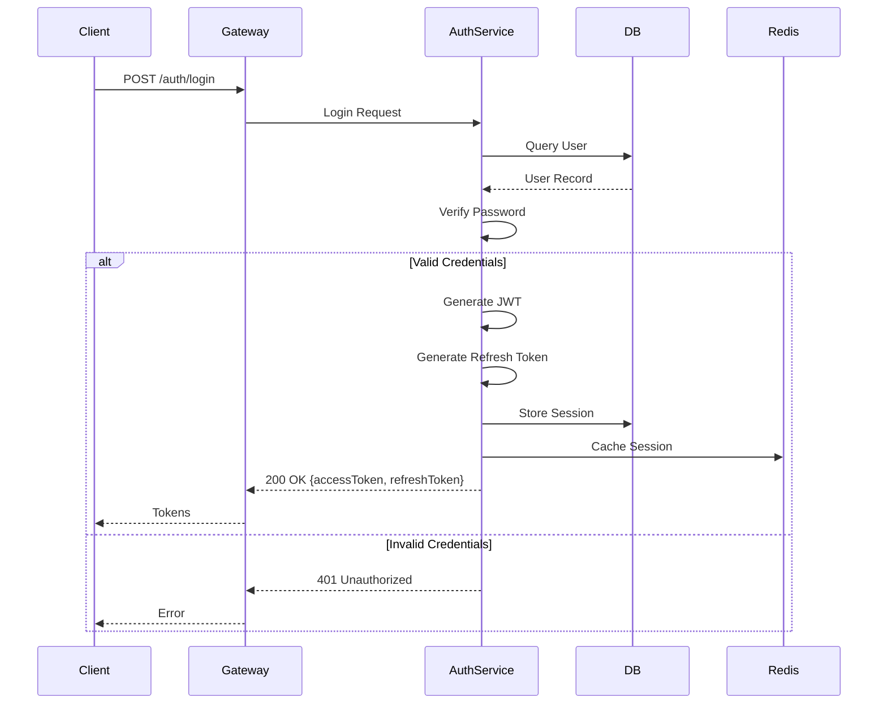

# SECTION 5: SYSTEM ARCHITECTURE

## Khasino - Complete Technical Architecture

**Version:** 2.0
**Date:** June 2026
**Status:** Production-Grade Architecture Design

---

## Table of Contents

1. [Architecture Overview](#architecture-overview)
2. [High-Level Architecture](#high-level-architecture)
3. [Component Architecture](#component-architecture)
4. [Service Architecture](#service-architecture)
5. [Data Flow Architecture](#data-flow-architecture)
6. [Deployment Architecture](#deployment-architecture)
7. [Scalability & Performance](#scalability--performance)

---

## 1. Architecture Overview

### 1.1 Architecture Principles

**Server-Authoritative**
- All game logic runs on backend
- Client is "dumb terminal" for rendering
- Prevents cheating and ensures fairness

**Event-Driven**
- Asynchronous communication via events
- Loose coupling between services
- Real-time updates via WebSockets

**Microservices**
- Independent, deployable services
- Single responsibility per service
- Technology-agnostic interfaces

**Scalable & Resilient**
- Horizontal scaling capability
- Auto-scaling based on load
- Graceful degradation
- Circuit breakers and retries

### 1.2 Technology Stack Summary

| Layer | Technology | Purpose |
|-------|------------|---------|
| **Mobile** | Flutter | iOS/Android native apps |
| **Web** | React + Vite | Web application |
| **API Gateway** | Kong / AWS API Gateway | Request routing, auth, rate limiting |
| **Backend** | Node.js + TypeScript | Business logic services |
| **Real-Time** | Socket.io / ws | WebSocket server |
| **Database** | PostgreSQL 15+ | Primary data store |
| **Cache** | Redis 7+ | Session, game state cache |
| **Queue** | RabbitMQ / AWS SQS | Async job processing |
| **Storage** | AWS S3 / GCS | Asset storage (images, videos) |
| **CDN** | CloudFront / Cloud CDN | Static asset delivery |
| **Container** | Docker | Application packaging |
| **Orchestration** | Kubernetes | Container management |
| **Cloud** | AWS / GCP | Infrastructure hosting |
| **Monitoring** | Datadog, Sentry | Observability |

---

## 2. High-Level Architecture



---

## 3. Component Architecture

### 3.1 Client Architecture (Flutter Mobile)



**Clean Architecture Layers:**

1. **Presentation:** UI components, screen logic
2. **Application:** State management, navigation
3. **Domain:** Business entities, use cases
4. **Data:** API clients, local storage, WebSockets
5. **Infrastructure:** Cross-cutting concerns

---

## 4. Service Architecture

### 4.1 Auth Service

**Responsibilities:**
- User registration and login
- JWT token generation/validation
- Refresh token management
- Password reset flows
- OAuth integration (Google, Facebook)
- Session management

**API Endpoints:**
```
POST   /api/v1/auth/register
POST   /api/v1/auth/login
POST   /api/v1/auth/refresh
POST   /api/v1/auth/logout
POST   /api/v1/auth/forgot-password
POST   /api/v1/auth/reset-password
GET    /api/v1/auth/verify-email/:token
```

**Dependencies:**
- PostgreSQL (users, auth_sessions)
- Redis (session cache, blacklist)
- Email service (verification, password reset)

### 4.2 User Service

**Responsibilities:**
- User profile management
- Avatar/cosmetics management
- User statistics and rankings
- Friend management
- User preferences

**API Endpoints:**
```
GET    /api/v1/users/:id
PUT    /api/v1/users/:id
GET    /api/v1/users/:id/stats
GET    /api/v1/users/:id/achievements
GET    /api/v1/users/:id/friends
POST   /api/v1/users/:id/friends/:friendId
DELETE /api/v1/users/:id/friends/:friendId
```

**Dependencies:**
- PostgreSQL (users, user_stats, user_friends)
- Redis (profile cache)
- S3 (avatar uploads)

### 4.3 Match Service

**Responsibilities:**
- Match creation and lifecycle
- Matchmaking algorithm
- Player joining/leaving
- Match history and replays

**API Endpoints:**
```
POST   /api/v1/matches
GET    /api/v1/matches/:id
POST   /api/v1/matches/:id/join
POST   /api/v1/matches/:id/leave
GET    /api/v1/matches/find (matchmaking)
GET    /api/v1/matches/history/:userId
```

**Dependencies:**
- PostgreSQL (matches, match_players)
- Redis (active matches, matchmaking queue)
- Game Engine Service
- Event Bus

### 4.4 Game Engine Service

**Responsibilities:**
- Core game logic (THE MOST CRITICAL SERVICE)
- Move validation
- Game state management
- AI opponent logic
- Score calculation
- Rule enforcement

**API Endpoints:**
```
POST   /api/v1/game/:matchId/move
GET    /api/v1/game/:matchId/state
POST   /api/v1/game/:matchId/validate-move
GET    /api/v1/game/:matchId/legal-moves
```

**Key Functions:**
```typescript
class GameEngine {
    validateMove(gameState, player, move): ValidationResult
    applyMove(gameState, move): GameState
    calculateScore(gameState): ScoreResult
    getLegalMoves(gameState, player): Move[]
    checkGameEnd(gameState): boolean
    getAIMove(gameState, difficulty): Move
}
```

**Dependencies:**
- PostgreSQL (game_states, moves, builds)
- Redis (active game state cache)
- Event Bus (move events, game events)

### 4.5 WebSocket Service

**Responsibilities:**
- Real-time bi-directional communication
- Event broadcasting
- Presence management
- Connection state management
- Reconnection handling

**Events (Server → Client):**
```
game:state_update
game:move_made
game:turn_changed
game:round_end
game:match_end
match:player_joined
match:player_left
chat:message
notification:received
```

**Events (Client → Server):**
```
game:make_move
chat:send_message
match:join
match:leave
presence:heartbeat
```

**Dependencies:**
- Redis (connection state, presence)
- Event Bus (inter-service events)
- Auth Service (WebSocket auth)

### 4.6 Tournament Service

**Responsibilities:**
- Tournament creation and management
- Registration and brackets
- Tournament progression
- Prize distribution

**API Endpoints:**
```
POST   /api/v1/tournaments
GET    /api/v1/tournaments/:id
POST   /api/v1/tournaments/:id/register
GET    /api/v1/tournaments/:id/bracket
GET    /api/v1/tournaments/upcoming
```

**Dependencies:**
- PostgreSQL (tournaments, tournament_players)
- Match Service
- Payment Service (prize distribution)

### 4.7 Payment Service

**Responsibilities:**
- Transaction processing
- Subscription management
- Cosmetic purchases
- Tournament entry fees
- Prize payouts

**API Endpoints:**
```
POST   /api/v1/payments/subscribe
POST   /api/v1/payments/purchase
POST   /api/v1/payments/webhook (provider callbacks)
GET    /api/v1/payments/transactions/:userId
```

**Dependencies:**
- PostgreSQL (transactions, user_inventory)
- Payment Gateway (Stripe, PayFast)
- User Service

---

## 5. Data Flow Architecture

### 5.1 Game Move Flow



### 5.2 Matchmaking Flow



### 5.3 Authentication Flow



---

## 6. Deployment Architecture

### 6.1 Kubernetes Architecture

```mermaid
graph TB
    subgraph "Kubernetes Cluster"
        subgraph "Ingress"
            Ingress[Ingress Controller<br/>NGINX/Traefik]
        end

        subgraph "Services"
            AuthPod[Auth Service Pods<br/>Replicas: 3]
            UserPod[User Service Pods<br/>Replicas: 3]
            MatchPod[Match Service Pods<br/>Replicas: 5]
            GamePod[Game Engine Pods<br/>Replicas: 10]
            WSPod[WebSocket Pods<br/>Replicas: 5]
        end

        subgraph "StatefulSets"
            RedisSet[Redis StatefulSet]
            RabbitSet[RabbitMQ StatefulSet]
        end

        subgraph "External"
            RDSDB[(RDS PostgreSQL)]
            S3Store[(S3 Storage)]
        end

        subgraph "ConfigMaps & Secrets"
            Config[ConfigMaps]
            Secrets[Secrets]
        end
    end

    Ingress --> AuthPod
    Ingress --> UserPod
    Ingress --> MatchPod
    Ingress --> GamePod
    Ingress --> WSPod

    AuthPod --> RedisSet
    UserPod --> RedisSet
    MatchPod --> RedisSet
    GamePod --> RedisSet

    AuthPod --> RDSDB
    UserPod --> RDSDB
    MatchPod --> RDSDB
    GamePod --> RDSDB

    GamePod --> RabbitSet
    WSPod --> RabbitSet

    UserPod --> S3Store

    AuthPod -.-> Config
    AuthPod -.-> Secrets
```

### 6.2 AWS Infrastructure

```
┌─────────────────────────────────────────────────────────┐
│                       Route 53                          │
│                  (DNS Management)                       │
└────────────────────┬────────────────────────────────────┘
                     │
┌────────────────────▼────────────────────────────────────┐
│                   CloudFront                            │
│            (CDN + Static Assets)                        │
└────────────────────┬────────────────────────────────────┘
                     │
┌────────────────────▼────────────────────────────────────┐
│              Application Load Balancer                  │
│         (Multi-AZ, Auto Scaling Target)                 │
└────────────────────┬────────────────────────────────────┘
                     │
        ┌────────────┴────────────┐
        │                         │
┌───────▼──────┐         ┌────────▼──────┐
│   EKS Cluster│         │  API Gateway  │
│  (Services)  │         │  (REST APIs)  │
└───────┬──────┘         └────────┬──────┘
        │                         │
        └────────────┬────────────┘
                     │
        ┌────────────┴────────────┐
        │                         │
┌───────▼──────┐         ┌────────▼──────┐
│  RDS (Postgres)│       │ ElastiCache   │
│  Multi-AZ     │         │   (Redis)     │
└───────────────┘         └───────────────┘
        │
┌───────▼──────┐
│  S3 Buckets  │
│ (Assets/Logs)│
└──────────────┘
```

**AWS Services Used:**
- **EKS**: Kubernetes cluster management
- **RDS**: PostgreSQL database (Multi-AZ)
- **ElastiCache**: Redis clusters
- **S3**: Object storage for assets
- **CloudFront**: CDN for global distribution
- **Route 53**: DNS and health checks
- **ALB**: Application load balancing
- **CloudWatch**: Monitoring and logging
- **Secrets Manager**: Credential management
- **ECR**: Docker image registry

---

## 7. Scalability & Performance

### 7.1 Horizontal Scaling Strategy

**Auto-Scaling Rules:**

```yaml
# Game Engine Service
apiVersion: autoscaling/v2
kind: HorizontalPodAutoscaler
metadata:
  name: game-engine-hpa
spec:
  scaleTargetRef:
    apiVersion: apps/v1
    kind: Deployment
    name: game-engine
  minReplicas: 5
  maxReplicas: 50
  metrics:
  - type: Resource
    resource:
      name: cpu
      target:
        type: Utilization
        averageUtilization: 70
  - type: Resource
    resource:
      name: memory
      target:
        type: Utilization
        averageUtilization: 80
```

**Scaling Triggers:**
- CPU > 70%
- Memory > 80%
- Active connections > threshold
- Request queue depth > threshold

### 7.2 Caching Strategy

**Redis Cache Layers:**

1. **Session Cache** (TTL: 24 hours)
   - User sessions
   - JWT blacklist

2. **Game State Cache** (TTL: 1 hour)
   - Active match states
   - Reduces DB reads by 90%

3. **User Profile Cache** (TTL: 15 minutes)
   - User details
   - Stats and achievements

4. **Matchmaking Queue** (TTL: 5 minutes)
   - Available matches
   - Player queue

**Cache Invalidation:**
```typescript
// Invalidate on state change
async function updateGameState(matchId, newState) {
    await db.saveGameState(newState);
    await redis.set(`game:${matchId}`, newState, 'EX', 3600);
    await eventBus.publish('game.state.updated', { matchId, newState });
}
```

### 7.3 Database Optimization

**Read/Write Splitting:**
- Writes: Primary RDS instance
- Reads: Read replicas (3x)
- Heavy analytics: Dedicated replica

**Connection Pooling:**
```javascript
const pool = new Pool({
    max: 20,                // Max connections per pod
    min: 5,                 // Min idle connections
    idleTimeoutMillis: 30000,
    connectionTimeoutMillis: 2000,
});
```

**Query Optimization:**
- Prepared statements for all queries
- Indexed columns for lookups
- Materialized views for leaderboards
- Partitioning for large tables (moves, game_states)

### 7.4 Performance Targets

| Metric | Target | Critical Threshold |
|--------|--------|-------------------|
| API Response Time (p95) | < 200ms | < 500ms |
| Game Move Processing | < 100ms | < 200ms |
| WebSocket Latency | < 50ms | < 100ms |
| Database Query (p95) | < 50ms | < 100ms |
| Match Creation | < 500ms | < 1s |
| Concurrent Users | 100,000+ | 50,000 min |
| Matches per Minute | 10,000+ | 5,000 min |
| Availability | 99.9% | 99.5% min |

---

*This architecture is designed to scale from MVP (thousands of users) to massive growth (millions of users) without fundamental rewrites.*

**Last Updated:** June 2, 2026
**Version:** 2.0
