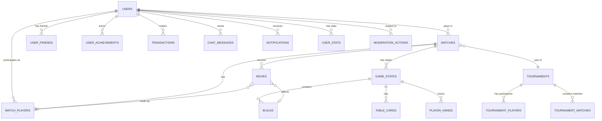

# SECTION 6: DATABASE DESIGN

## Khasino - Complete Database Schema & Architecture

**Version:** 2.0
**Date:** June 2026
**Database:** PostgreSQL 15+

---

## Table of Contents

1. [Database Overview](#database-overview)
2. [Schema Design Principles](#schema-design-principles)
3. [Entity Relationship Diagram](#entity-relationship-diagram)
4. [Core Tables](#core-tables)
5. [Complete DDL](#complete-ddl)
6. [Indexes & Performance](#indexes--performance)
7. [Data Migration Strategy](#data-migration-strategy)

---

## 1. Database Overview

### 1.1 Technology Stack

- **Database:** PostgreSQL 15.4+
- **Connection Pooling:** PgBouncer
- **Replication:** Master-Replica (Read replicas)
- **Backup:** Automated daily backups, PITR enabled
- **Extensions:** uuid-ossp, pg_trgm, pgcrypto

### 1.2 Database Architecture

```
┌─────────────────────────────────────┐
│     Application Servers             │
│  (Node.js Backend Services)         │
└───────────────┬─────────────────────┘
                │
        ┌───────▼────────┐
        │   PgBouncer    │
        │ (Connection    │
        │    Pooling)    │
        └───────┬────────┘
                │
    ┌───────────▼────────────┐
    │  PostgreSQL Primary    │
    │   (Write/Read)         │
    └───┬────────────────┬───┘
        │                │
┌───────▼──────┐  ┌─────▼────────┐
│ Read Replica │  │ Read Replica │
│  (Analytics) │  │   (Queries)  │
└──────────────┘  └──────────────┘
```

---

## 2. Schema Design Principles

### 2.1 Naming Conventions

- **Tables:** Plural, snake_case (e.g., `users`, `game_states`)
- **Columns:** snake_case (e.g., `created_at`, `user_id`)
- **Primary Keys:** `id` (UUID)
- **Foreign Keys:** `{table_singular}_id` (e.g., `user_id`)
- **Indexes:** `idx_{table}_{columns}` (e.g., `idx_matches_status`)
- **Unique Constraints:** `uq_{table}_{columns}`

### 2.2 Standard Columns

Every table includes:
```sql
id UUID PRIMARY KEY DEFAULT uuid_generate_v4(),
created_at TIMESTAMP WITH TIME ZONE DEFAULT CURRENT_TIMESTAMP,
updated_at TIMESTAMP WITH TIME ZONE DEFAULT CURRENT_TIMESTAMP
```

### 2.3 Data Integrity

- All foreign keys have explicit constraints
- Cascading deletes defined where appropriate
- Check constraints for enums and ranges
- NOT NULL constraints for required fields

---

## 3. Entity Relationship Diagram



---

## 4. Core Tables

### 4.1 Users & Authentication

#### users
Primary user account information.

| Column | Type | Constraints | Description |
|--------|------|-------------|-------------|
| id | UUID | PK | User unique identifier |
| username | VARCHAR(50) | UNIQUE, NOT NULL | Display name |
| email | VARCHAR(255) | UNIQUE, NOT NULL | Email address |
| email_verified | BOOLEAN | DEFAULT false | Email verification status |
| password_hash | VARCHAR(255) | NOT NULL | Bcrypt hashed password |
| phone_number | VARCHAR(20) | NULLABLE | Phone for 2FA |
| phone_verified | BOOLEAN | DEFAULT false | Phone verification status |
| avatar_url | VARCHAR(500) | NULLABLE | Profile picture URL |
| country_code | VARCHAR(2) | NOT NULL | ISO country code |
| preferred_language | VARCHAR(5) | DEFAULT 'en' | Language preference |
| is_premium | BOOLEAN | DEFAULT false | Premium subscription |
| premium_expires_at | TIMESTAMP | NULLABLE | Premium expiry date |
| account_status | VARCHAR(20) | DEFAULT 'active' | active/suspended/banned |
| last_login_at | TIMESTAMP | NULLABLE | Last login timestamp |
| created_at | TIMESTAMP | NOT NULL | Account creation |
| updated_at | TIMESTAMP | NOT NULL | Last update |

#### auth_sessions
Active user sessions for JWT management.

| Column | Type | Constraints | Description |
|--------|------|-------------|-------------|
| id | UUID | PK | Session identifier |
| user_id | UUID | FK→users, NOT NULL | Session owner |
| refresh_token | VARCHAR(500) | UNIQUE, NOT NULL | Refresh token |
| device_info | JSONB | NULLABLE | Device metadata |
| ip_address | INET | NULLABLE | Login IP |
| expires_at | TIMESTAMP | NOT NULL | Token expiry |
| revoked | BOOLEAN | DEFAULT false | Manual revocation |
| created_at | TIMESTAMP | NOT NULL | Session start |

### 4.2 Matches & Gameplay

#### matches
Core match/game sessions.

| Column | Type | Constraints | Description |
|--------|------|-------------|-------------|
| id | UUID | PK | Match identifier |
| match_type | VARCHAR(20) | NOT NULL | casual/ranked/tournament |
| game_mode | VARCHAR(20) | NOT NULL | two_player/three_player/four_player/partnership |
| status | VARCHAR(20) | NOT NULL | waiting/active/completed/abandoned |
| current_round | INT | DEFAULT 1 | Current round (1 or 2) |
| current_turn_player_id | UUID | FK→users, NULLABLE | Whose turn |
| dealer_id | UUID | FK→users, NOT NULL | Current dealer |
| winner_id | UUID | FK→users, NULLABLE | Match winner |
| scoring_mode | VARCHAR(20) | NOT NULL | eleven_point/seven_point |
| tournament_id | UUID | FK→tournaments, NULLABLE | Parent tournament |
| started_at | TIMESTAMP | NULLABLE | Match start time |
| completed_at | TIMESTAMP | NULLABLE | Match end time |
| created_at | TIMESTAMP | NOT NULL | Match creation |
| updated_at | TIMESTAMP | NOT NULL | Last update |

#### match_players
Players participating in a match.

| Column | Type | Constraints | Description |
|--------|------|-------------|-------------|
| id | UUID | PK | Record identifier |
| match_id | UUID | FK→matches, NOT NULL | Parent match |
| user_id | UUID | FK→users, NULLABLE | Human player (NULL for AI) |
| position | INT | NOT NULL | Seat position (0-3) |
| is_ai | BOOLEAN | DEFAULT false | AI opponent |
| ai_difficulty | VARCHAR(20) | NULLABLE | easy/medium/hard/expert |
| partner_id | UUID | FK→match_players, NULLABLE | Partnership mode |
| final_score | INT | DEFAULT 0 | Points scored |
| cards_captured | INT | DEFAULT 0 | Total cards captured |
| spades_captured | INT | DEFAULT 0 | Spades captured |
| rank_change | INT | DEFAULT 0 | ELO change |
| created_at | TIMESTAMP | NOT NULL | Join time |
| updated_at | TIMESTAMP | NOT NULL | Last update |

### 4.3 Game State

#### game_states
Complete game state snapshots (for recovery and replay).

| Column | Type | Constraints | Description |
|--------|------|-------------|-------------|
| id | UUID | PK | State identifier |
| match_id | UUID | FK→matches, NOT NULL | Parent match |
| turn_number | INT | NOT NULL | Sequential turn |
| current_player_id | UUID | FK→users, NOT NULL | Active player |
| deck_remaining | INT | NOT NULL | Cards left in deck |
| state_data | JSONB | NOT NULL | Complete state JSON |
| created_at | TIMESTAMP | NOT NULL | State timestamp |

**state_data structure:**
```json
{
  "table_cards": [{"suit": "SPADES", "rank": "7", "value": 7}],
  "builds": [
    {
      "id": "uuid",
      "owner_id": "uuid",
      "value": 10,
      "is_compound": false,
      "cards": [{"suit": "HEARTS", "rank": "6", "value": 6}]
    }
  ],
  "player_hands": {
    "player_uuid": [{"suit": "DIAMONDS", "rank": "A", "value": 1}]
  },
  "capture_piles": {
    "player_uuid": [{"suit": "CLUBS", "rank": "10", "value": 10}]
  }
}
```

#### moves
Individual move history (for analytics and replay).

| Column | Type | Constraints | Description |
|--------|------|-------------|-------------|
| id | UUID | PK | Move identifier |
| match_id | UUID | FK→matches, NOT NULL | Parent match |
| player_id | UUID | FK→match_players, NOT NULL | Player who moved |
| turn_number | INT | NOT NULL | Turn sequence |
| move_type | VARCHAR(20) | NOT NULL | capture/build/change/augment/drift/stash |
| card_played | JSONB | NOT NULL | Card from hand |
| targets | JSONB | NULLABLE | Cards/builds affected |
| result | JSONB | NULLABLE | Outcome details |
| time_taken_ms | INT | NULLABLE | Think time |
| created_at | TIMESTAMP | NOT NULL | Move timestamp |

#### builds
Current active builds on the table.

| Column | Type | Constraints | Description |
|--------|------|-------------|-------------|
| id | UUID | PK | Build identifier |
| match_id | UUID | FK→matches, NOT NULL | Parent match |
| owner_id | UUID | FK→match_players, NOT NULL | Build owner |
| value | INT | NOT NULL | Build target value (1-10) |
| is_compound | BOOLEAN | DEFAULT false | Simple or compound |
| cards | JSONB | NOT NULL | Array of card objects |
| position | INT | NOT NULL | Table position |
| created_at | TIMESTAMP | NOT NULL | Build creation |
| updated_at | TIMESTAMP | NOT NULL | Last modification |

### 4.4 Tournaments

#### tournaments
Tournament definitions and scheduling.

| Column | Type | Constraints | Description |
|--------|------|-------------|-------------|
| id | UUID | PK | Tournament identifier |
| name | VARCHAR(200) | NOT NULL | Tournament name |
| tournament_type | VARCHAR(20) | NOT NULL | single_elim/double_elim/round_robin |
| entry_fee | DECIMAL(10,2) | DEFAULT 0 | Entry cost |
| prize_pool | DECIMAL(10,2) | DEFAULT 0 | Total prizes |
| max_players | INT | NOT NULL | Capacity |
| current_players | INT | DEFAULT 0 | Registered count |
| status | VARCHAR(20) | NOT NULL | registration/active/completed/cancelled |
| game_mode | VARCHAR(20) | NOT NULL | Match format |
| start_time | TIMESTAMP | NOT NULL | Scheduled start |
| end_time | TIMESTAMP | NULLABLE | Actual end |
| rules | JSONB | NOT NULL | Tournament rules |
| created_by | UUID | FK→users, NOT NULL | Tournament organizer |
| created_at | TIMESTAMP | NOT NULL | Creation time |
| updated_at | TIMESTAMP | NOT NULL | Last update |

#### tournament_players
Tournament participants and standings.

| Column | Type | Constraints | Description |
|--------|------|-------------|-------------|
| id | UUID | PK | Record identifier |
| tournament_id | UUID | FK→tournaments, NOT NULL | Parent tournament |
| user_id | UUID | FK→users, NOT NULL | Participant |
| seed | INT | NULLABLE | Seeding position |
| current_round | INT | DEFAULT 0 | Current bracket round |
| wins | INT | DEFAULT 0 | Matches won |
| losses | INT | DEFAULT 0 | Matches lost |
| points | INT | DEFAULT 0 | Total points |
| final_position | INT | NULLABLE | Final placement |
| prize_amount | DECIMAL(10,2) | NULLABLE | Winnings |
| eliminated | BOOLEAN | DEFAULT false | Still active |
| registered_at | TIMESTAMP | NOT NULL | Registration time |

### 4.5 Social & Community

#### user_friends
Friend relationships.

| Column | Type | Constraints | Description |
|--------|------|-------------|-------------|
| id | UUID | PK | Relationship identifier |
| user_id | UUID | FK→users, NOT NULL | Requesting user |
| friend_id | UUID | FK→users, NOT NULL | Friend user |
| status | VARCHAR(20) | NOT NULL | pending/accepted/blocked |
| created_at | TIMESTAMP | NOT NULL | Request time |
| accepted_at | TIMESTAMP | NULLABLE | Acceptance time |

#### chat_messages
In-game and lobby chat.

| Column | Type | Constraints | Description |
|--------|------|-------------|-------------|
| id | UUID | PK | Message identifier |
| match_id | UUID | FK→matches, NULLABLE | Match context |
| sender_id | UUID | FK→users, NOT NULL | Message sender |
| message_type | VARCHAR(20) | NOT NULL | text/emoji/system |
| content | TEXT | NOT NULL | Message content |
| language | VARCHAR(5) | NOT NULL | Message language |
| is_flagged | BOOLEAN | DEFAULT false | Moderation flag |
| created_at | TIMESTAMP | NOT NULL | Send time |

### 4.6 Achievements & Rankings

#### user_stats
Player statistics and rankings.

| Column | Type | Constraints | Description |
|--------|------|-------------|-------------|
| user_id | UUID | PK, FK→users | Player |
| matches_played | INT | DEFAULT 0 | Total matches |
| matches_won | INT | DEFAULT 0 | Wins |
| matches_lost | INT | DEFAULT 0 | Losses |
| win_rate | DECIMAL(5,2) | DEFAULT 0 | Win percentage |
| elo_rating | INT | DEFAULT 1200 | ELO rating |
| highest_elo | INT | DEFAULT 1200 | Peak rating |
| total_points_scored | INT | DEFAULT 0 | Cumulative points |
| total_cards_captured | INT | DEFAULT 0 | All cards captured |
| perfect_games | INT | DEFAULT 0 | 11-0 or 7-0 wins |
| tournament_wins | INT | DEFAULT 0 | Tournaments won |
| current_streak | INT | DEFAULT 0 | Win streak |
| longest_streak | INT | DEFAULT 0 | Best streak |
| updated_at | TIMESTAMP | NOT NULL | Last stat update |

#### achievements
Achievement definitions.

| Column | Type | Constraints | Description |
|--------|------|-------------|-------------|
| id | UUID | PK | Achievement identifier |
| code | VARCHAR(50) | UNIQUE, NOT NULL | Internal code |
| name | VARCHAR(100) | NOT NULL | Display name |
| description | TEXT | NOT NULL | How to earn |
| icon_url | VARCHAR(500) | NOT NULL | Icon image |
| category | VARCHAR(20) | NOT NULL | Category |
| rarity | VARCHAR(20) | NOT NULL | common/rare/epic/legendary |
| points | INT | NOT NULL | XP reward |
| criteria | JSONB | NOT NULL | Unlock criteria |
| created_at | TIMESTAMP | NOT NULL | Added date |

#### user_achievements
User achievement unlocks.

| Column | Type | Constraints | Description |
|--------|------|-------------|-------------|
| id | UUID | PK | Record identifier |
| user_id | UUID | FK→users, NOT NULL | Player |
| achievement_id | UUID | FK→achievements, NOT NULL | Achievement |
| unlocked_at | TIMESTAMP | NOT NULL | Unlock time |
| notified | BOOLEAN | DEFAULT false | Notification sent |

### 4.7 Monetization

#### transactions
All monetary transactions.

| Column | Type | Constraints | Description |
|--------|------|-------------|-------------|
| id | UUID | PK | Transaction identifier |
| user_id | UUID | FK→users, NOT NULL | Customer |
| transaction_type | VARCHAR(50) | NOT NULL | subscription/cosmetic/tournament/refund |
| amount | DECIMAL(10,2) | NOT NULL | Transaction amount |
| currency | VARCHAR(3) | DEFAULT 'ZAR' | Currency code |
| payment_method | VARCHAR(50) | NOT NULL | Payment provider |
| payment_provider_id | VARCHAR(255) | NULLABLE | External ID |
| status | VARCHAR(20) | NOT NULL | pending/completed/failed/refunded |
| item_details | JSONB | NULLABLE | Purchase details |
| created_at | TIMESTAMP | NOT NULL | Transaction time |

#### cosmetic_items
Available cosmetic purchases.

| Column | Type | Constraints | Description |
|--------|------|-------------|-------------|
| id | UUID | PK | Item identifier |
| item_type | VARCHAR(50) | NOT NULL | card_back/table_theme/avatar |
| name | VARCHAR(100) | NOT NULL | Item name |
| description | TEXT | NULLABLE | Item description |
| price | DECIMAL(10,2) | NOT NULL | Cost |
| currency | VARCHAR(3) | DEFAULT 'ZAR' | Currency |
| preview_url | VARCHAR(500) | NOT NULL | Preview image |
| asset_url | VARCHAR(500) | NOT NULL | Asset file |
| is_available | BOOLEAN | DEFAULT true | In shop |
| created_at | TIMESTAMP | NOT NULL | Added date |

#### user_inventory
User-owned cosmetics.

| Column | Type | Constraints | Description |
|--------|------|-------------|-------------|
| id | UUID | PK | Record identifier |
| user_id | UUID | FK→users, NOT NULL | Owner |
| cosmetic_item_id | UUID | FK→cosmetic_items, NOT NULL | Item |
| is_equipped | BOOLEAN | DEFAULT false | Currently active |
| acquired_at | TIMESTAMP | NOT NULL | Purchase time |

### 4.8 Moderation & Safety

#### moderation_actions
Moderation events and enforcement.

| Column | Type | Constraints | Description |
|--------|------|-------------|-------------|
| id | UUID | PK | Action identifier |
| user_id | UUID | FK→users, NOT NULL | Subject user |
| moderator_id | UUID | FK→users, NULLABLE | Moderator (NULL for automated) |
| action_type | VARCHAR(50) | NOT NULL | warning/mute/suspend/ban |
| reason | TEXT | NOT NULL | Explanation |
| evidence | JSONB | NULLABLE | Supporting data |
| duration_hours | INT | NULLABLE | Temporary duration |
| expires_at | TIMESTAMP | NULLABLE | Expiry time |
| is_active | BOOLEAN | DEFAULT true | Currently enforced |
| created_at | TIMESTAMP | NOT NULL | Action time |

#### anti_cheat_logs
Suspicious activity detection.

| Column | Type | Constraints | Description |
|--------|------|-------------|-------------|
| id | UUID | PK | Log identifier |
| user_id | UUID | FK→users, NOT NULL | Suspect user |
| match_id | UUID | FK→matches, NULLABLE | Match context |
| detection_type | VARCHAR(50) | NOT NULL | Type of anomaly |
| severity | VARCHAR(20) | NOT NULL | low/medium/high/critical |
| details | JSONB | NOT NULL | Detection details |
| auto_action_taken | BOOLEAN | DEFAULT false | Automatic response |
| reviewed | BOOLEAN | DEFAULT false | Human reviewed |
| created_at | TIMESTAMP | NOT NULL | Detection time |

### 4.9 Notifications

#### notifications
User notifications.

| Column | Type | Constraints | Description |
|--------|------|-------------|-------------|
| id | UUID | PK | Notification identifier |
| user_id | UUID | FK→users, NOT NULL | Recipient |
| notification_type | VARCHAR(50) | NOT NULL | Type of notification |
| title | VARCHAR(200) | NOT NULL | Notification title |
| message | TEXT | NOT NULL | Message content |
| data | JSONB | NULLABLE | Additional data |
| is_read | BOOLEAN | DEFAULT false | Read status |
| created_at | TIMESTAMP | NOT NULL | Creation time |

---

## 5. Complete DDL

### 5.1 Core Schema Creation

```sql
-- Enable required extensions
CREATE EXTENSION IF NOT EXISTS "uuid-ossp";
CREATE EXTENSION IF NOT EXISTS "pg_trgm";
CREATE EXTENSION IF NOT EXISTS "pgcrypto";

-- Create updated_at trigger function
CREATE OR REPLACE FUNCTION update_updated_at_column()
RETURNS TRIGGER AS $$
BEGIN
    NEW.updated_at = CURRENT_TIMESTAMP;
    RETURN NEW;
END;
$$ LANGUAGE plpgsql;

-- ============================================================================
-- USERS & AUTHENTICATION
-- ============================================================================

CREATE TABLE users (
    id UUID PRIMARY KEY DEFAULT uuid_generate_v4(),
    username VARCHAR(50) UNIQUE NOT NULL,
    email VARCHAR(255) UNIQUE NOT NULL,
    email_verified BOOLEAN DEFAULT false,
    password_hash VARCHAR(255) NOT NULL,
    phone_number VARCHAR(20),
    phone_verified BOOLEAN DEFAULT false,
    avatar_url VARCHAR(500),
    country_code VARCHAR(2) NOT NULL,
    preferred_language VARCHAR(5) DEFAULT 'en',
    is_premium BOOLEAN DEFAULT false,
    premium_expires_at TIMESTAMP WITH TIME ZONE,
    account_status VARCHAR(20) DEFAULT 'active' CHECK (account_status IN ('active', 'suspended', 'banned', 'deleted')),
    last_login_at TIMESTAMP WITH TIME ZONE,
    created_at TIMESTAMP WITH TIME ZONE DEFAULT CURRENT_TIMESTAMP,
    updated_at TIMESTAMP WITH TIME ZONE DEFAULT CURRENT_TIMESTAMP,

    CONSTRAINT chk_premium_expiry CHECK (
        (is_premium = false AND premium_expires_at IS NULL) OR
        (is_premium = true AND premium_expires_at IS NOT NULL)
    )
);

CREATE TRIGGER update_users_updated_at BEFORE UPDATE ON users
    FOR EACH ROW EXECUTE FUNCTION update_updated_at_column();

CREATE TABLE auth_sessions (
    id UUID PRIMARY KEY DEFAULT uuid_generate_v4(),
    user_id UUID NOT NULL REFERENCES users(id) ON DELETE CASCADE,
    refresh_token VARCHAR(500) UNIQUE NOT NULL,
    device_info JSONB,
    ip_address INET,
    expires_at TIMESTAMP WITH TIME ZONE NOT NULL,
    revoked BOOLEAN DEFAULT false,
    created_at TIMESTAMP WITH TIME ZONE DEFAULT CURRENT_TIMESTAMP
);

-- ============================================================================
-- MATCHES & GAMEPLAY
-- ============================================================================

CREATE TABLE matches (
    id UUID PRIMARY KEY DEFAULT uuid_generate_v4(),
    match_type VARCHAR(20) NOT NULL CHECK (match_type IN ('casual', 'ranked', 'tournament', 'private')),
    game_mode VARCHAR(20) NOT NULL CHECK (game_mode IN ('two_player', 'three_player', 'four_player', 'partnership')),
    status VARCHAR(20) NOT NULL DEFAULT 'waiting' CHECK (status IN ('waiting', 'active', 'completed', 'abandoned')),
    current_round INT DEFAULT 1 CHECK (current_round IN (1, 2)),
    current_turn_player_id UUID REFERENCES users(id),
    dealer_id UUID NOT NULL REFERENCES users(id),
    winner_id UUID REFERENCES users(id),
    scoring_mode VARCHAR(20) NOT NULL CHECK (scoring_mode IN ('eleven_point', 'seven_point')),
    tournament_id UUID,
    started_at TIMESTAMP WITH TIME ZONE,
    completed_at TIMESTAMP WITH TIME ZONE,
    created_at TIMESTAMP WITH TIME ZONE DEFAULT CURRENT_TIMESTAMP,
    updated_at TIMESTAMP WITH TIME ZONE DEFAULT CURRENT_TIMESTAMP
);

CREATE TRIGGER update_matches_updated_at BEFORE UPDATE ON matches
    FOR EACH ROW EXECUTE FUNCTION update_updated_at_column();

CREATE TABLE match_players (
    id UUID PRIMARY KEY DEFAULT uuid_generate_v4(),
    match_id UUID NOT NULL REFERENCES matches(id) ON DELETE CASCADE,
    user_id UUID REFERENCES users(id),
    position INT NOT NULL CHECK (position BETWEEN 0 AND 3),
    is_ai BOOLEAN DEFAULT false,
    ai_difficulty VARCHAR(20) CHECK (ai_difficulty IN ('easy', 'medium', 'hard', 'expert')),
    partner_id UUID REFERENCES match_players(id),
    final_score INT DEFAULT 0,
    cards_captured INT DEFAULT 0,
    spades_captured INT DEFAULT 0,
    rank_change INT DEFAULT 0,
    created_at TIMESTAMP WITH TIME ZONE DEFAULT CURRENT_TIMESTAMP,
    updated_at TIMESTAMP WITH TIME ZONE DEFAULT CURRENT_TIMESTAMP,

    CONSTRAINT chk_ai_player CHECK (
        (is_ai = false AND user_id IS NOT NULL AND ai_difficulty IS NULL) OR
        (is_ai = true AND user_id IS NULL AND ai_difficulty IS NOT NULL)
    ),
    UNIQUE(match_id, position)
);

CREATE TRIGGER update_match_players_updated_at BEFORE UPDATE ON match_players
    FOR EACH ROW EXECUTE FUNCTION update_updated_at_column();

CREATE TABLE game_states (
    id UUID PRIMARY KEY DEFAULT uuid_generate_v4(),
    match_id UUID NOT NULL REFERENCES matches(id) ON DELETE CASCADE,
    turn_number INT NOT NULL,
    current_player_id UUID NOT NULL REFERENCES users(id),
    deck_remaining INT NOT NULL CHECK (deck_remaining BETWEEN 0 AND 40),
    state_data JSONB NOT NULL,
    created_at TIMESTAMP WITH TIME ZONE DEFAULT CURRENT_TIMESTAMP,

    UNIQUE(match_id, turn_number)
);

CREATE TABLE moves (
    id UUID PRIMARY KEY DEFAULT uuid_generate_v4(),
    match_id UUID NOT NULL REFERENCES matches(id) ON DELETE CASCADE,
    player_id UUID NOT NULL REFERENCES match_players(id),
    turn_number INT NOT NULL,
    move_type VARCHAR(20) NOT NULL CHECK (move_type IN ('capture', 'build', 'change_build', 'augment', 'drift', 'stash')),
    card_played JSONB NOT NULL,
    targets JSONB,
    result JSONB,
    time_taken_ms INT,
    created_at TIMESTAMP WITH TIME ZONE DEFAULT CURRENT_TIMESTAMP
);

CREATE TABLE builds (
    id UUID PRIMARY KEY DEFAULT uuid_generate_v4(),
    match_id UUID NOT NULL REFERENCES matches(id) ON DELETE CASCADE,
    owner_id UUID NOT NULL REFERENCES match_players(id),
    value INT NOT NULL CHECK (value BETWEEN 1 AND 10),
    is_compound BOOLEAN DEFAULT false,
    cards JSONB NOT NULL,
    position INT NOT NULL,
    created_at TIMESTAMP WITH TIME ZONE DEFAULT CURRENT_TIMESTAMP,
    updated_at TIMESTAMP WITH TIME ZONE DEFAULT CURRENT_TIMESTAMP
);

CREATE TRIGGER update_builds_updated_at BEFORE UPDATE ON builds
    FOR EACH ROW EXECUTE FUNCTION update_updated_at_column();

-- ============================================================================
-- TOURNAMENTS
-- ============================================================================

CREATE TABLE tournaments (
    id UUID PRIMARY KEY DEFAULT uuid_generate_v4(),
    name VARCHAR(200) NOT NULL,
    tournament_type VARCHAR(20) NOT NULL CHECK (tournament_type IN ('single_elimination', 'double_elimination', 'round_robin')),
    entry_fee DECIMAL(10,2) DEFAULT 0 CHECK (entry_fee >= 0),
    prize_pool DECIMAL(10,2) DEFAULT 0 CHECK (prize_pool >= 0),
    max_players INT NOT NULL CHECK (max_players > 0),
    current_players INT DEFAULT 0 CHECK (current_players >= 0),
    status VARCHAR(20) NOT NULL DEFAULT 'registration' CHECK (status IN ('registration', 'active', 'completed', 'cancelled')),
    game_mode VARCHAR(20) NOT NULL,
    start_time TIMESTAMP WITH TIME ZONE NOT NULL,
    end_time TIMESTAMP WITH TIME ZONE,
    rules JSONB NOT NULL,
    created_by UUID NOT NULL REFERENCES users(id),
    created_at TIMESTAMP WITH TIME ZONE DEFAULT CURRENT_TIMESTAMP,
    updated_at TIMESTAMP WITH TIME ZONE DEFAULT CURRENT_TIMESTAMP
);

CREATE TRIGGER update_tournaments_updated_at BEFORE UPDATE ON tournaments
    FOR EACH ROW EXECUTE FUNCTION update_updated_at_column();

ALTER TABLE matches ADD CONSTRAINT fk_matches_tournament
    FOREIGN KEY (tournament_id) REFERENCES tournaments(id);

CREATE TABLE tournament_players (
    id UUID PRIMARY KEY DEFAULT uuid_generate_v4(),
    tournament_id UUID NOT NULL REFERENCES tournaments(id) ON DELETE CASCADE,
    user_id UUID NOT NULL REFERENCES users(id),
    seed INT,
    current_round INT DEFAULT 0,
    wins INT DEFAULT 0 CHECK (wins >= 0),
    losses INT DEFAULT 0 CHECK (losses >= 0),
    points INT DEFAULT 0,
    final_position INT,
    prize_amount DECIMAL(10,2),
    eliminated BOOLEAN DEFAULT false,
    registered_at TIMESTAMP WITH TIME ZONE DEFAULT CURRENT_TIMESTAMP,

    UNIQUE(tournament_id, user_id)
);

-- ============================================================================
-- SOCIAL & COMMUNITY
-- ============================================================================

CREATE TABLE user_friends (
    id UUID PRIMARY KEY DEFAULT uuid_generate_v4(),
    user_id UUID NOT NULL REFERENCES users(id) ON DELETE CASCADE,
    friend_id UUID NOT NULL REFERENCES users(id) ON DELETE CASCADE,
    status VARCHAR(20) NOT NULL DEFAULT 'pending' CHECK (status IN ('pending', 'accepted', 'blocked')),
    created_at TIMESTAMP WITH TIME ZONE DEFAULT CURRENT_TIMESTAMP,
    accepted_at TIMESTAMP WITH TIME ZONE,

    CONSTRAINT chk_not_self_friend CHECK (user_id != friend_id),
    UNIQUE(user_id, friend_id)
);

CREATE TABLE chat_messages (
    id UUID PRIMARY KEY DEFAULT uuid_generate_v4(),
    match_id UUID REFERENCES matches(id) ON DELETE CASCADE,
    sender_id UUID NOT NULL REFERENCES users(id),
    message_type VARCHAR(20) NOT NULL DEFAULT 'text' CHECK (message_type IN ('text', 'emoji', 'system')),
    content TEXT NOT NULL,
    language VARCHAR(5) NOT NULL DEFAULT 'en',
    is_flagged BOOLEAN DEFAULT false,
    created_at TIMESTAMP WITH TIME ZONE DEFAULT CURRENT_TIMESTAMP
);

-- ============================================================================
-- ACHIEVEMENTS & RANKINGS
-- ============================================================================

CREATE TABLE user_stats (
    user_id UUID PRIMARY KEY REFERENCES users(id) ON DELETE CASCADE,
    matches_played INT DEFAULT 0 CHECK (matches_played >= 0),
    matches_won INT DEFAULT 0 CHECK (matches_won >= 0),
    matches_lost INT DEFAULT 0 CHECK (matches_lost >= 0),
    win_rate DECIMAL(5,2) DEFAULT 0 CHECK (win_rate BETWEEN 0 AND 100),
    elo_rating INT DEFAULT 1200 CHECK (elo_rating >= 0),
    highest_elo INT DEFAULT 1200 CHECK (highest_elo >= 0),
    total_points_scored INT DEFAULT 0 CHECK (total_points_scored >= 0),
    total_cards_captured INT DEFAULT 0 CHECK (total_cards_captured >= 0),
    perfect_games INT DEFAULT 0 CHECK (perfect_games >= 0),
    tournament_wins INT DEFAULT 0 CHECK (tournament_wins >= 0),
    current_streak INT DEFAULT 0,
    longest_streak INT DEFAULT 0 CHECK (longest_streak >= 0),
    updated_at TIMESTAMP WITH TIME ZONE DEFAULT CURRENT_TIMESTAMP
);

CREATE TRIGGER update_user_stats_updated_at BEFORE UPDATE ON user_stats
    FOR EACH ROW EXECUTE FUNCTION update_updated_at_column();

CREATE TABLE achievements (
    id UUID PRIMARY KEY DEFAULT uuid_generate_v4(),
    code VARCHAR(50) UNIQUE NOT NULL,
    name VARCHAR(100) NOT NULL,
    description TEXT NOT NULL,
    icon_url VARCHAR(500) NOT NULL,
    category VARCHAR(20) NOT NULL,
    rarity VARCHAR(20) NOT NULL CHECK (rarity IN ('common', 'rare', 'epic', 'legendary')),
    points INT NOT NULL DEFAULT 0,
    criteria JSONB NOT NULL,
    created_at TIMESTAMP WITH TIME ZONE DEFAULT CURRENT_TIMESTAMP
);

CREATE TABLE user_achievements (
    id UUID PRIMARY KEY DEFAULT uuid_generate_v4(),
    user_id UUID NOT NULL REFERENCES users(id) ON DELETE CASCADE,
    achievement_id UUID NOT NULL REFERENCES achievements(id),
    unlocked_at TIMESTAMP WITH TIME ZONE DEFAULT CURRENT_TIMESTAMP,
    notified BOOLEAN DEFAULT false,

    UNIQUE(user_id, achievement_id)
);

-- ============================================================================
-- MONETIZATION
-- ============================================================================

CREATE TABLE transactions (
    id UUID PRIMARY KEY DEFAULT uuid_generate_v4(),
    user_id UUID NOT NULL REFERENCES users(id),
    transaction_type VARCHAR(50) NOT NULL,
    amount DECIMAL(10,2) NOT NULL CHECK (amount >= 0),
    currency VARCHAR(3) DEFAULT 'ZAR',
    payment_method VARCHAR(50) NOT NULL,
    payment_provider_id VARCHAR(255),
    status VARCHAR(20) NOT NULL DEFAULT 'pending' CHECK (status IN ('pending', 'completed', 'failed', 'refunded')),
    item_details JSONB,
    created_at TIMESTAMP WITH TIME ZONE DEFAULT CURRENT_TIMESTAMP
);

CREATE TABLE cosmetic_items (
    id UUID PRIMARY KEY DEFAULT uuid_generate_v4(),
    item_type VARCHAR(50) NOT NULL CHECK (item_type IN ('card_back', 'table_theme', 'avatar', 'emote')),
    name VARCHAR(100) NOT NULL,
    description TEXT,
    price DECIMAL(10,2) NOT NULL CHECK (price >= 0),
    currency VARCHAR(3) DEFAULT 'ZAR',
    preview_url VARCHAR(500) NOT NULL,
    asset_url VARCHAR(500) NOT NULL,
    is_available BOOLEAN DEFAULT true,
    created_at TIMESTAMP WITH TIME ZONE DEFAULT CURRENT_TIMESTAMP
);

CREATE TABLE user_inventory (
    id UUID PRIMARY KEY DEFAULT uuid_generate_v4(),
    user_id UUID NOT NULL REFERENCES users(id) ON DELETE CASCADE,
    cosmetic_item_id UUID NOT NULL REFERENCES cosmetic_items(id),
    is_equipped BOOLEAN DEFAULT false,
    acquired_at TIMESTAMP WITH TIME ZONE DEFAULT CURRENT_TIMESTAMP,

    UNIQUE(user_id, cosmetic_item_id)
);

-- ============================================================================
-- MODERATION & SAFETY
-- ============================================================================

CREATE TABLE moderation_actions (
    id UUID PRIMARY KEY DEFAULT uuid_generate_v4(),
    user_id UUID NOT NULL REFERENCES users(id),
    moderator_id UUID REFERENCES users(id),
    action_type VARCHAR(50) NOT NULL CHECK (action_type IN ('warning', 'mute', 'suspend', 'ban')),
    reason TEXT NOT NULL,
    evidence JSONB,
    duration_hours INT,
    expires_at TIMESTAMP WITH TIME ZONE,
    is_active BOOLEAN DEFAULT true,
    created_at TIMESTAMP WITH TIME ZONE DEFAULT CURRENT_TIMESTAMP
);

CREATE TABLE anti_cheat_logs (
    id UUID PRIMARY KEY DEFAULT uuid_generate_v4(),
    user_id UUID NOT NULL REFERENCES users(id),
    match_id UUID REFERENCES matches(id),
    detection_type VARCHAR(50) NOT NULL,
    severity VARCHAR(20) NOT NULL CHECK (severity IN ('low', 'medium', 'high', 'critical')),
    details JSONB NOT NULL,
    auto_action_taken BOOLEAN DEFAULT false,
    reviewed BOOLEAN DEFAULT false,
    created_at TIMESTAMP WITH TIME ZONE DEFAULT CURRENT_TIMESTAMP
);

-- ============================================================================
-- NOTIFICATIONS
-- ============================================================================

CREATE TABLE notifications (
    id UUID PRIMARY KEY DEFAULT uuid_generate_v4(),
    user_id UUID NOT NULL REFERENCES users(id) ON DELETE CASCADE,
    notification_type VARCHAR(50) NOT NULL,
    title VARCHAR(200) NOT NULL,
    message TEXT NOT NULL,
    data JSONB,
    is_read BOOLEAN DEFAULT false,
    created_at TIMESTAMP WITH TIME ZONE DEFAULT CURRENT_TIMESTAMP
);
```

---

## 6. Indexes & Performance

### 6.1 Essential Indexes

```sql
-- Users
CREATE INDEX idx_users_email ON users(email);
CREATE INDEX idx_users_username ON users(username);
CREATE INDEX idx_users_country_code ON users(country_code);
CREATE INDEX idx_users_account_status ON users(account_status) WHERE account_status != 'deleted';
CREATE INDEX idx_users_is_premium ON users(is_premium) WHERE is_premium = true;

-- Auth Sessions
CREATE INDEX idx_auth_sessions_user_id ON auth_sessions(user_id);
CREATE INDEX idx_auth_sessions_refresh_token ON auth_sessions(refresh_token);
CREATE INDEX idx_auth_sessions_expires_at ON auth_sessions(expires_at) WHERE NOT revoked;

-- Matches
CREATE INDEX idx_matches_status ON matches(status);
CREATE INDEX idx_matches_match_type ON matches(match_type);
CREATE INDEX idx_matches_tournament_id ON matches(tournament_id);
CREATE INDEX idx_matches_dealer_id ON matches(dealer_id);
CREATE INDEX idx_matches_created_at ON matches(created_at DESC);
CREATE INDEX idx_matches_active ON matches(status, updated_at) WHERE status = 'active';

-- Match Players
CREATE INDEX idx_match_players_match_id ON match_players(match_id);
CREATE INDEX idx_match_players_user_id ON match_players(user_id);
CREATE INDEX idx_match_players_partner_id ON match_players(partner_id);

-- Game States
CREATE INDEX idx_game_states_match_id ON game_states(match_id, turn_number DESC);

-- Moves
CREATE INDEX idx_moves_match_id ON moves(match_id, turn_number);
CREATE INDEX idx_moves_player_id ON moves(player_id);
CREATE INDEX idx_moves_created_at ON moves(created_at DESC);

-- Tournaments
CREATE INDEX idx_tournaments_status ON tournaments(status);
CREATE INDEX idx_tournaments_start_time ON tournaments(start_time);
CREATE INDEX idx_tournaments_created_by ON tournaments(created_by);

-- Tournament Players
CREATE INDEX idx_tournament_players_tournament_id ON tournament_players(tournament_id);
CREATE INDEX idx_tournament_players_user_id ON tournament_players(user_id);

-- User Stats
CREATE INDEX idx_user_stats_elo_rating ON user_stats(elo_rating DESC);
CREATE INDEX idx_user_stats_matches_won ON user_stats(matches_won DESC);

-- Chat Messages
CREATE INDEX idx_chat_messages_match_id ON chat_messages(match_id, created_at);
CREATE INDEX idx_chat_messages_sender_id ON chat_messages(sender_id);
CREATE INDEX idx_chat_messages_flagged ON chat_messages(is_flagged) WHERE is_flagged = true;

-- Notifications
CREATE INDEX idx_notifications_user_id ON notifications(user_id, created_at DESC);
CREATE INDEX idx_notifications_unread ON notifications(user_id, is_read) WHERE is_read = false;

-- Full-text search
CREATE INDEX idx_users_username_trgm ON users USING gin(username gin_trgm_ops);
CREATE INDEX idx_achievements_name_trgm ON achievements USING gin(name gin_trgm_ops);
```

### 6.2 Composite Indexes for Common Queries

```sql
-- Matchmaking queries
CREATE INDEX idx_matches_matchmaking ON matches(match_type, status, created_at)
    WHERE status = 'waiting';

-- Leaderboard queries
CREATE INDEX idx_user_stats_leaderboard ON user_stats(elo_rating DESC, matches_won DESC);

-- Tournament standings
CREATE INDEX idx_tournament_players_standings ON tournament_players(tournament_id, points DESC, wins DESC);

-- Active game lookup
CREATE INDEX idx_match_players_active_games ON match_players(user_id, match_id)
    WHERE match_id IN (SELECT id FROM matches WHERE status IN ('waiting', 'active'));
```

---

## 7. Data Migration Strategy

### 7.1 Migration Framework

Use **node-pg-migrate** for version-controlled schema migrations.

```javascript
// Example migration file: migrations/001_initial_schema.js
exports.up = (pgm) => {
    pgm.sql(/* DDL from section 5 */);
};

exports.down = (pgm) => {
    pgm.sql('DROP SCHEMA public CASCADE; CREATE SCHEMA public;');
};
```

### 7.2 Seed Data

```sql
-- Insert default achievements
INSERT INTO achievements (code, name, description, category, rarity, points, criteria, icon_url) VALUES
('first_win', 'First Victory', 'Win your first match', 'gameplay', 'common', 10, '{"matches_won": 1}', '/icons/first_win.png'),
('perfect_11', 'Perfect Game', 'Win a match 11-0', 'gameplay', 'epic', 100, '{"perfect_11": 1}', '/icons/perfect_11.png'),
('spy_two_master', 'Spy Two Master', 'Capture the Two of Spades 100 times', 'special', 'rare', 50, '{"spy_two_captures": 100}', '/icons/spy_two.png'),
('tournament_champion', 'Tournament Champion', 'Win a tournament', 'competitive', 'legendary', 500, '{"tournament_wins": 1}', '/icons/champion.png');
```

### 7.3 Backup & Recovery

```bash
# Daily automated backup
pg_dump -Fc khasino_production > backup_$(date +%Y%m%d).dump

# Point-in-time recovery setup
wal_level = replica
archive_mode = on
archive_command = 'cp %p /archive/%f'
```

---

*This database schema supports all core features of the Khasino platform with scalability, performance, and data integrity as primary design goals.*

**Last Updated:** June 2, 2026
**Version:** 2.0
